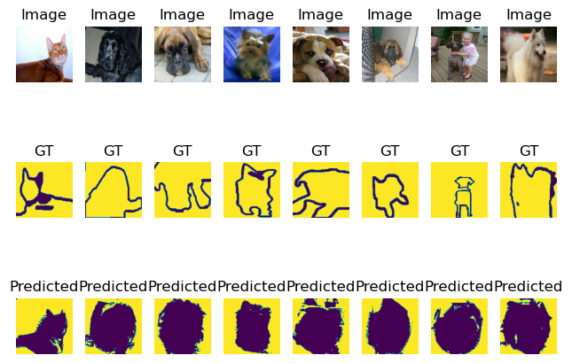
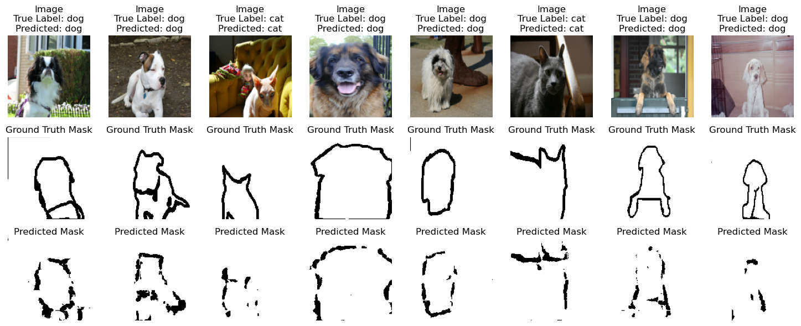

# Image Segmentation using SVM and CNNs with Oxford IIIT Pet Dataset

This project performs binary segmentation on the [Oxford-IIIT Pet Dataset](https://www.robots.ox.ac.uk/~vgg/data/pets/) using SVM as well as a custom-built convolutional neural network (CNN) implemented in PyTorch.

## To get started: download dependencies and create a virtual environment with python >= 3.11. 

### Dependencies can be found in the requirements.txt file. To quickly download dependencies, run `pip install -r requirements.txt`. 

### Results

The model demonstrates the ability to separate pet regions from background with pixel-level accuracy. Training loss converges steadily, and sample visualizations of predictions are displayed.

### SVM Segmentation Results
These are predictions made using the SVM trained on RGB + XY features.

---

### CNN Segmentation Results
These are predictions made using the custom CNN.

